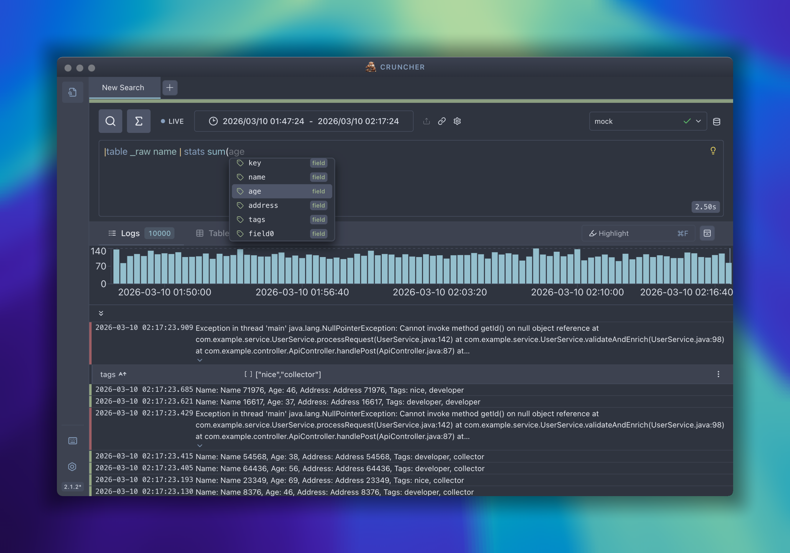

# Cruncher

Ever wanted to post process your data?  
`Cruncher` is here for the rescue!

---

Heavily inspired from observability tools like `Splunk`, `Grafana` and more -  
it's main purpose is to allow post process data from multiple sources.  
Goal is to have a generic query language and to implement adapters to different backends - 
then, you get all investigation capabilities right from the user's computer.

In earlier versions, `Cruncher` was built with a mindset to be embedded everywhere - like inside an extension - so everything was built under unique [shadowDOM](https://developer.mozilla.org/en-US/docs/Web/API/Web_components/Using_shadow_DOM).  
`Cruncher` is now a standalone application, aiming to be a powerful tool for data analysis and visualization.

## Features
- **Crunch Logs**: Post-process your logs and create custom views.
- **Visualise**: Build custom dashboards and visualisations.
- **Multiple Sources**: Connect to multiple data sources and crunch them all together!
- **Quick Query Language**: Cruncher uses [QQL](/qql-reference/01-qql) (custom language) that is easy to learn and powerful.