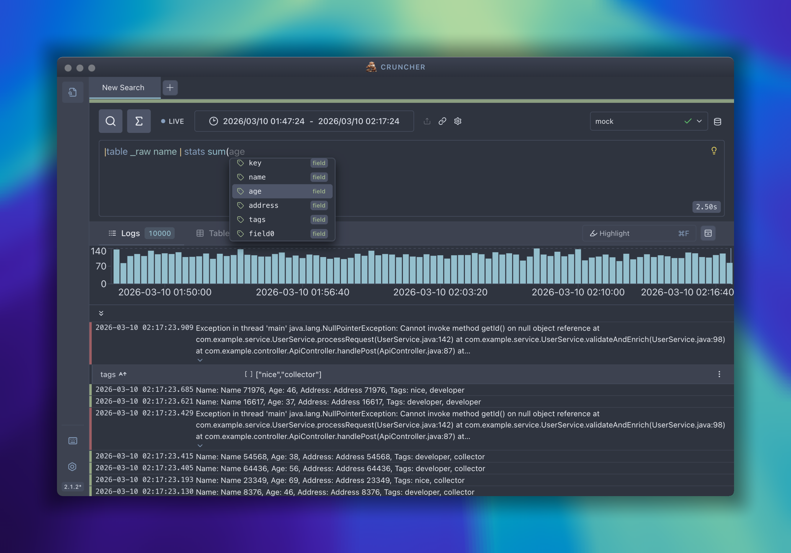

import FeatureGrid from '../../../components/FeatureGrid.astro';
import AdapterCard from '../../../components/AdapterCard.astro';

# Cruncher

**Cruncher is a powerful Electron desktop application that lets you investigate logs from multiple sources with a unified query interface.**

Inspired by observability tools like Splunk and Grafana, Cruncher brings advanced log investigation capabilities to your computer without relying on external services. Connect to your data sources, query with QQL (Quick Query Language), and analyze results with rich visualizations—all offline and on your machine.

## What is Cruncher?

Cruncher is a standalone desktop application that:
- **Connects to multiple log sources** via a flexible adapter system (Grafana, Loki, Kubernetes, Docker, Coralogix, and more)
- **Provides a unified query language** (QQL) inspired by SPL2 and KQL, easy to learn but powerful
- **Gives you investigation capabilities** directly on your computer—no backend required
- **Offers a beautiful, responsive UI** built with React and optimized for desktop

## Key Features

<FeatureGrid columns={2} features={[
  {
    icon: "📑",
    title: "Multi-tab Interface",
    description: "Organize multiple searches in tabs, each with independent time ranges and queries"
  },
  {
    icon: "📊",
    title: "Histogram View",
    description: "Visualize log distribution over time with interactive bucket navigation"
  },
  {
    icon: "👁️",
    title: "Rich Result Views",
    description: "Automatic Logs, Table (after `| table` or `| stats`), and Charts (after `| timechart`)"
  },
  {
    icon: "🔍",
    title: "Row Details Panel",
    description: "Inspect individual records with field types, copy values, and quick append-to-query buttons"
  },
  {
    icon: "⌨️",
    title: "Keyboard Shortcuts",
    description: "Power-user shortcuts for all common actions — see [Keyboard Shortcuts](/getting-started/07-keyboard-shortcuts)"
  },
  {
    icon: "🎨",
    title: "Multiple Themes",
    description: "Choose from Midnight, Nord, Dracula, or Catppuccin themes"
  }
]} />

## Adapters at a Glance

Cruncher comes with built-in adapters for all your log sources:

  <AdapterCard
    name="Grafana Loki Browser"
    type="grafana_browser"
    description="Query Loki through Grafana UI with browser-based authentication"
    link="/adapters/grafana-loki"
    icon="🔷"
  />
  <AdapterCard
    name="Loki Direct"
    type="loki"
    description="Direct Loki access without Grafana wrapper for standalone deployments"
    link="/adapters/loki"
    icon="📡"
  />
  <AdapterCard
    name="Kubernetes"
    type="k8s"
    description="Query pod logs directly from your cluster"
    link="/adapters/kubernetes"
    icon="☸️"
  />
  <AdapterCard
    name="Docker"
    type="docker"
    description="Stream logs from local Docker containers"
    link="/adapters/docker"
    icon="🐳"
  />
  <AdapterCard
    name="Coralogix"
    type="coralogix"
    description="Connect to the Coralogix log management platform"
    link="/adapters/coralogix"
    icon="🌐"
  />
  <AdapterCard
    name="Mocked Data"
    type="mocked_data"
    description="Local test data for demos and learning"
    link="/adapters/mocked-data"
    icon="🎲"
  />

See [Adapters](/getting-started/04-adapters) for full configuration details.